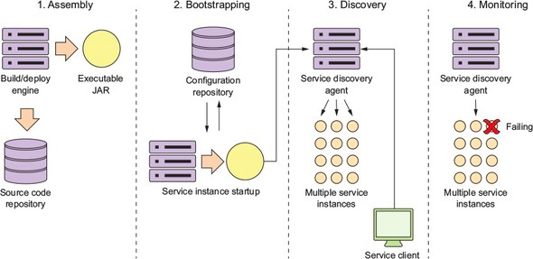
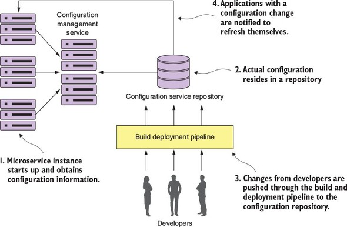
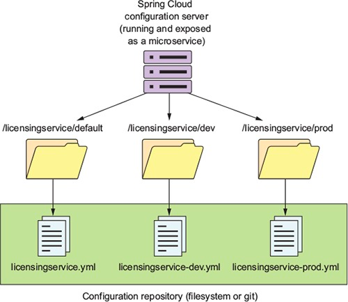
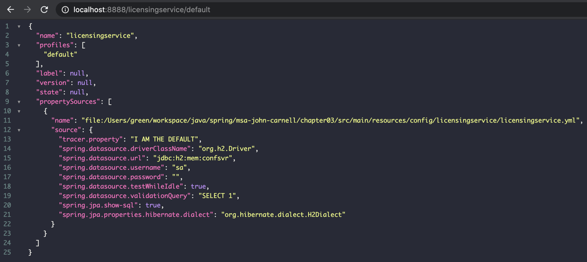
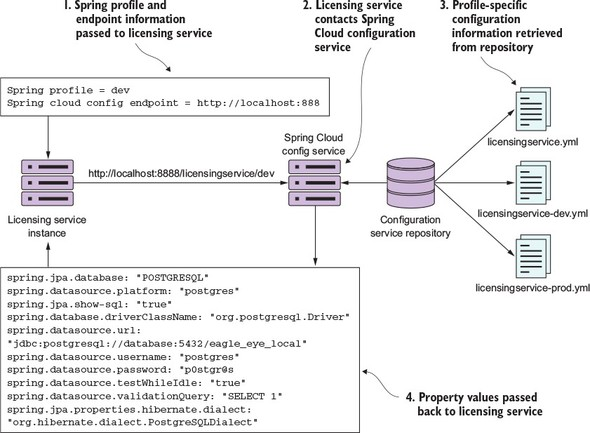
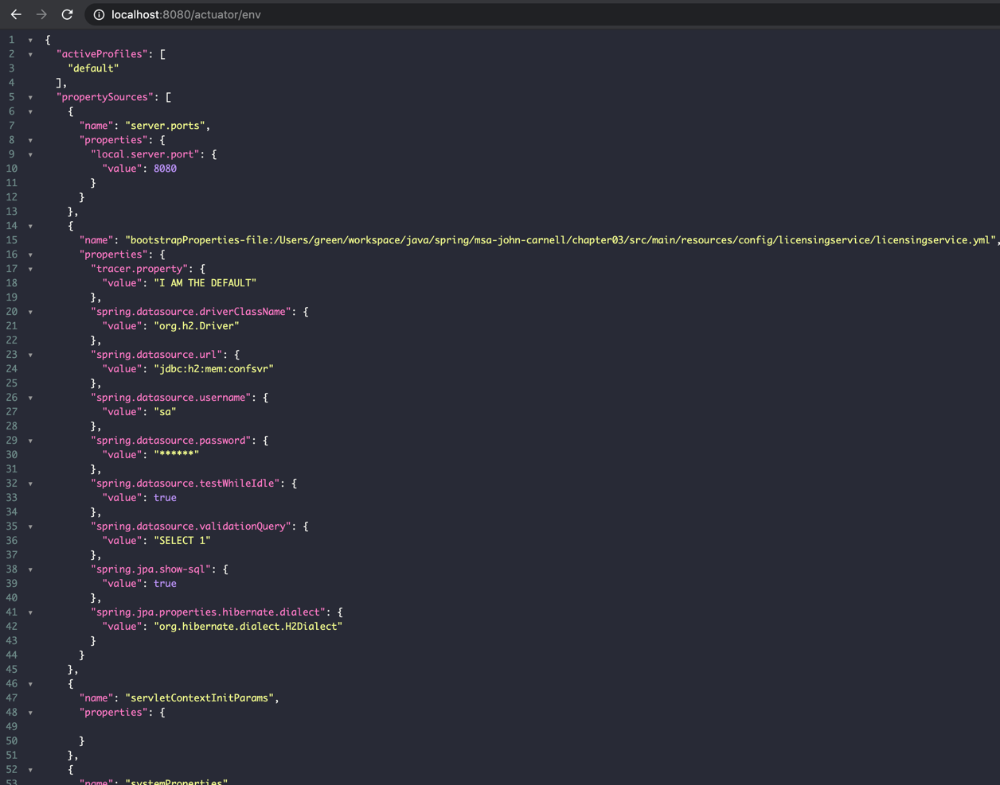

# 스프링 클라우드 컨피그 서버로 구성 관리

## 3.1 구성(그리고 복잡성) 관리
우리가 지키고 싶은 애플리케이션 구성 관리를 위한 원칙은,

##### 1. 분리 (segregate)
구성 정보랑 서비스를 분리해서 운영하는 거죠.

##### 2. 추상화 (abstract)
서비스 인터페이스 뒷쪽에 있는 구성 데이터에 접근하는 방식을 추상화 하래요. 하드코딩 하지 말고, 뭔가 매개체를 이용하라는 얘긴가?

##### 3. 중앙 집중식 (centralize)
서비스가 여러개 있고, 클라우드 기반으로 인스턴스가 여러개 만들어 지는데, 구성 정보를 관리가 일원화 돼야 관리가 되겠네요.

##### 4. 견고성 (harden)
구성 정보를 여러 곳에서 불러다 쓰게 될테니 당연히 고가용성과 다중성이 고려되야 하겠어요.

### 3.1.1 구성 관리 아키텍쳐
  
여기서 Bootstrapping 단계에서 구성 관리가 사용 되겠죠.  
Bootstrapping 단계에서 실행되는 내용을 자세히 보면,
  
1. 마이크로서비스 인스턴스가 실행되고 구성 정보를 가져오고,
2. 실제 구성 정보를 서비스내의 저장소에 저장하고,
3. 개발자들이 구성 정보를 변경하면, 빌드 및 배포와 연결된 통로로 전달하고,
4. 새로 변경된 구성 정보를 대상 서비스에 알려줘요.

### 3.1.2 구현 선택
~~하.. 구현체가 많네요, 또... 천하 통일은 언제 쯤...~~  

| 프로젝트 이름 | 설명 | 특징 |
|---|---|---|
|Etcd|Go-lang, 서비스 검색, Key-Value 저장소|초고속, 확장가능, 분산 가능, 명령줄 위주(?), 사용과 설치 쉬움|
|유레카(Eureka)|서비스 검색, Key-Value 저장소|분산 Key-Value, 유연하지만 설정에 공수 필요, 동적 클라이언트 갱신 기능(!)|
|콘설(Consul)|Etcd, Eureka 랑 비슷|빠르고, DNS와 직접 통합해 네이티브로 서비스 검색, 동적 클라이언트 갱신이 기본기능 아님(플러그인 같은 걸로 있다는 뜻?)|
|주키퍼(Zookeeper)|분산 잠금 기능(distributed locking)|이름을 제일 많이 들어봤네, 근데 가장 복잡하대요. 별로 신경 쓰지 말 친구|
|스프링 클라우드 컨피그 서버|제일 좋음!|그냥 다 좋음!|

## 3.2 스프링 클라우드 컨피그 서버 구축

[Mavne POM](./pom.xml) 을 확인하시고요.

### 3.2.1 스프링 클라우드 컨피그 부트스트랩 클래스 설정
  
애플리케이션 구성 파일명 규칙은 `앱이름-환경.yml` 로 해요.  
[licensingservice.yml](./src/main/resources/config/licensingservice/licensingservice.yml) 을 하나 만들어요. `-dev.yml`, `-prod.yml` 은 일단 넘기고.

### 3.2.2 파일 시스템과 스프링 클라우드 컨피그 서버 사용

[Chapter03Application.java](./src/main/java/study/spring/springmsajohncarnell/chapter03/Chapter03Application.java) 코드 완성 후 서비스를 실행하고,
`http://localhost:8888/licensingservice/default` 로 접근하면  
  
이렇게 프로퍼티를 확인할 수 있어요.

## 3.3 스프링 클라우드 컨피그와 스프링 부트 클라이언의 통합

  
1. 라이선싱 서비스로 보내는 스프링 프로파일과 엔드포인트고요,
2. 그렇게 라이선싱 서비스와 스프링 클라우드 컨피그 서비스는 연결되고,
3. 저장소에서 조회 할 수 있는 프로파일별 구성 정보고요,
4. 라이선싱 서비스로 돌아온 속성 값들 이에요.

### 3.3.1 스프링 클라우드 컨피그 서버의 의존성 설정

일단은 [라이선싱 서비스에 Maven](../chapter02/pom.xml) 의존성을 추가해 보죠.

### 3.3.2 스프링 클라우드 컨피그를 위한 라이선싱 서비스 구성

[bootstrap.yml](../chapter02/src/main/resources/bootstrap.yml) 파일을 하나 만들고 설정을 해요.
여기서 중요한 건, `spring.cloud.config.uri` 속성으로 컨피그 서버의 엔드포인트죠.
그래서 `http://localhost:8080/actuator/env` 로 접근하면,  
  
처럼 컨피그 서버에서 땡겨온 설정 내용을 볼 수 있어요.
> 저는 spring-boot 최신 버전(2.3.1)으로 확인 하고 있는데, actuator 의 env 엔드포인트가 보안상 활성화가 안되네요.  
> 그래서 application.yml 에 `management.endpoints.web.exposure.include: "*"` 를 추가해서 확인 했어요.

### 3.3.3 스프링 클라우드 컨피그 서버로 데이터 소스 연결
### 3.3.4 @Value 애너테이션으로 프로퍼티 직접 읽기

[코드는 그냥 깃헙에서 보는 걸로...](../chapter02/src/main/java/study/spring/springmsajohncarnel/chapter02)

### 3.3.5 깃과 스프링 클라우드 컨피그 서버 사용

컨피그 서버의 `application.yml` 을
```yaml
spring:
  cloud:
    config:
      server:
        encrypt:
          enabled: false
        git:
          uri: "https://github.com/greenn-lab/spring-msa-john-carnell"
          search-paths: "chapter03/src/main/resources/config/licensingservice"
``` 
이렇게 바꾸고,  
라이선싱 서비스에 `@RefreshScopes` 를 추가 해줬어요. 그다음 컨피그 서버의 설정 정보 확인하고, 라이선싱 서비스의 설정 정보 확인하고.  
그 다음 깃헙에서 `licensingservice.yml` 파일의 속성 값을 변경한 후에  
라이선싱 서비스의 actuator refresh 를 호출(POST로 가능)하니까 신박하게도 설정 값이 바뀌네요. 대 to the 박!

## 3.4 중요한 구성 정보 보호
### 3.4.1 암호화에 필요한 오라클 JCE 파일을 내려받아 설치
 
