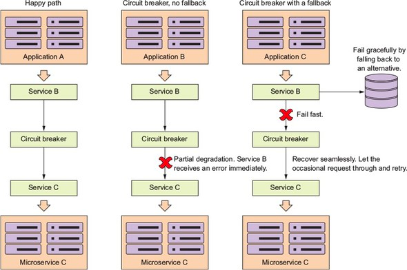
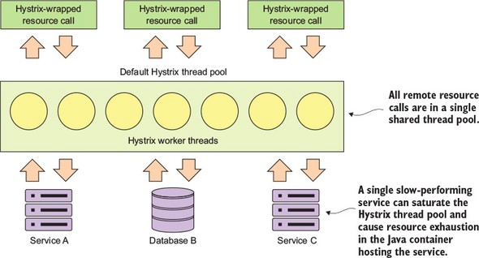
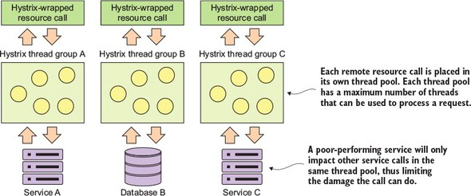

# 5. 나쁜 상황에 대비한 스프링 클라우드와 넷플릭스 히스트릭스의 클라이언트 회복성 패턴

## 5.1 클라이언트 회복성 패턴이란?


### 5.1.1 클라이언트 측 부하 분산
리본 써서 해보자는 얘기?!

### 5.1.2 회로 차단기
원격 서비스 호출을 모니터링하다가 처리가 오래걸리면 중재해서 호출을 중단시킨대요. 

### 5.1.3 폴백 처리
에러나면 다른 뭔가로 대체해준다는 뭐 그런거죠.

### 5.1.4 벌크헤드
위험 차단용 칸막이를 여러개 둔다는 거겠죠. 스레드를 풀로 관리해서 하나의 호출이 지연돼도, 나머지 스레드는 영향을 받지 않도록 한다는 거래요.

## 5.2 클라이언트 회복성이 중요한 이유
  
그림이 복잡해 보이는데 좋은 상황(Happy path) 은 그냥 냅두고, 대체재가 없는 회로 차단기(Circuit breaker no fallback)는 부분적인 성능저하가 있을 때 "Service B"가 에러를 직접 받아요.
대체재가 있는 회로 차단기(Circuit breaker with fallback)는 빠르게 실패하고, 대안을 제시받아서 우아하게(?) 실패한대요.

간헐적으로 저하된 서비스를 호출하고, 연속적으로 충분히 성공하면 회로 차단기를 재설정도 하네요.

어쨌든, 핵심 기능은
1. **빠른 실패(Fail fast)**를 해서 전체 어플리케이션을 다운시키는 자원 고갈을 미연에 방지하고,
2. **우아하게 실패(Fail gracefully)**를 유도해서 대체재를 제공하고,
3. **매끄러운 회복(Recovery seamlessly)**으로 요청 서비스가 정상적인지 스스로 판단해서 접근을 제어하는 것이죠.

## 5.3 히스트릭스 시작
스레드를 견고하게 작동시키는 코드는 예술의 영역이라는 지은이의 통찰, 마음 깊이 새겼네요. 스프링이랑 히스트릭스가 알아서 잘 해주니까 걱정말라는 얘기.

## 5.4 스프링 클라우드와 히스트릭스를 위한 라이선싱 서버 설정
일단 의존성 처리를 해주고요.
```xml
<dependency>
  <groupId>org.springframework.cloud</groupId>
  <artifactId>spring-cloud-starter-netflix-hystrix</artifactId>
</dependency>
```
그다음에 `@EnableCircuitBreaker` 를 넣어 주는 거죠, [Chapter02LicensingServiceApplication.java](../chapter02/Chapter02LicensingServiceApplication.java) 여기에.

책에서는 `com.netflix.hystrix.exception.HystrixRuntimeException` 이 날아온다고 돼있는데, 최신 버전(spring-cloud-starter-*, Hoxton.SR6)에서는 `java.util.concurrent.TimeoutException` 이 날아오네요.

## 5.5 히스트릭스를 사용한 회로 차단기 구현
`@HystrixCommand` 를 적절하게 달아주는 코드는 [LicenseService.java](../chapter02/service/LicenseService.java) 여기에 있어요.

### 5.5.1 조직 마이크로서비스에 대한 호출 타임아웃
다른 마이크로서비스를 호출하건 데이터베이스를 접근하건 `@HystrixCommand` 를 걸어주면 동일하게 스레드로 알아서 처리된대요.
근데, 설정없이 쓰는건 비추한대요. 하나의 스레드풀에서 이것저것 실행될테니까요.

### 5.5.2 회로 차단기의 타임아웃 사용자 정의
```java
  @HystrixCommand(
      commandProperties = {
          @HystrixProperty(
              name = "execution.isolation.thread.timeoutInMillseconds",
              value = "5000"
          )
      }
  )
  public List<License> getLicensesByOrg(String organizationId) {
  // ...
  }
```
기본적으로 타임아웃이 1초로 설정 돼 있대요. 위 코드처럼 하면 5초간 주는 거고.  
모든 프로퍼티들은 [netflix hystrix 깃헙](https://github.com/Netflix/Hystrix/wiki/Configuration) 에서 확인 할 수 있네요.

## 5.6 폴백 프로세싱
대체재를 어떻게 할거냔 거겠죠. 간단히 `fallbackMethod` 속성을 주면 되네요.
```java
@HystrixCommand(fallbackMethod = "buildFallbackLicenseList")
// method body
```
파라미터는 동일하게 줘야 하는 거군요.

## 5.7 벌크해드 패턴 구현
기본적으로 서비스의 비정상적인 종료를 방지하는 거네요. 우리 카넬형님, 다 좋은데... 이번에는 "컨테이너의 비정상적인 종료 방지" 라고 하셔요. 용어가 서비스, 컨테이너, 어플리케이션 등등. 좀, 혼재되는 경향이 있네요. 의역을 해줘도 될 부분이었던 것도 같고요.

  
하나의 공유 스레드에서 모든 원격 자원을 호출하네요. 그러면 느린 성능의 어떤 한 서비스가 스레드 풀을 잠식해서 자원을 고갈 시킨다는 거죠.  

  
그래서 요렇게 자원별로 스레드 풀을 3개를 만들어서 분리하면 느린 서비스랑 격리돼서 좋다는 거죠, 뭐.  
코드로는
```java
  @HystrixCommand(
      threadPoolKey = "licenseByOrgThreadPool",
      threadPoolProperties = {
        @HystrixProperty(name = "coreSize", value = "30"),
        @HystrixProperty(name = "maxQueueSize", value = "10")
      }
  )
  public List<License> getLicensesByOrg(String organizationId) {
    // ...
  }
``` 
`threadPoolProperties` 속성은 [Netflix Hystrix 깃헙](https://github.com/Netflix/Hystrix/wiki/Configuration#ThreadPool)에서 확인 할 수 있네요.

넷플릭스에서 제안하는 스레드 풀의 적정 크기는  
> (requests per second at peak when the service is healthy * 99th percentile latency in seconds) + small amount of extra threads for overhead  

뭔소린지 모르겠네요.

## 5.8 히스트릭스 세부 설정
위에서 천기누설을 한걸까요, [Netflix Hystrix 깃헙](https://github.com/Netflix/Hystrix/wiki/Configuration) 여기 내용을 보시면 되겠네요.

## 5.9 스레드 컨텍스트와 히스트릭스
`@HystrixCommand` 는 기본적으로 thread 방식의 격리 전략을 수행하는데, semaphore 방식도 있대요. ~~슬슬 포기하고 싶어지는데...~~

### 5.9.1 ThreadLocal 과 히스트릭스
`ThreadLocal` 클래스를 이용해서 스레드가 잘 가용되는지 확인하려면 굳이 `UserContextHolder` 같은 걸 만들어서 해볼게 아니라, 그냥 스레드 명칭을 로깅해보면 되는거 아니었을까 싶네요.  
지은이가 굳이 `UserContextHolder` 를 만든 이유를 모르겠네요.

### 5.9.2 HystrixConcurrencyStrategy
아하! 요놈을 확인하기 위해서 `UserContextHolder` 를 만들었던 거군요.  
코드가 길고 복잡한데, 어쨌든 `@HystrixCommand` 를 이용하면서 스레드가 달라지면 기존에 ThreadLocal 로 만들어진 spring-security 등이 정상적으로 작동을 안할 수 있겠네요.  
그래서 복잡하지만 `HystrixConcurrencyStrategy` 를 꼭 써야만 하고,
히스트릭스가 하나의 `HystrixConcurrencyStrategy` 만 허용하기 때문에 등록 절차 또한 복잡하네요. ~~이러니까 코딩하기가 싫어지는...~~  
아마 spring-cloud 팀이 복잡한 이런짓을 깔끔하고 간결하게 해결하는 어노테이션을 만들어주지 않을까, 기대해 봅니다 :)    

