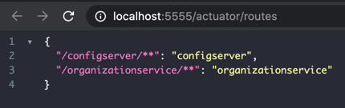
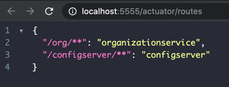
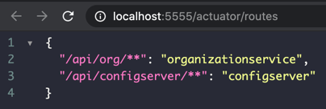

# 6. 스프링 클라우드와 주울로 서비스 라우팅

## 6.1 서비스 게이트웨이란?
한마디로 모든 트래픽의 게이트키퍼 역할을 한다는 거네요.
서비스 게이트웨이에서 구현할 관심사는

- **정적 라우팅(static routing)** 단일 서비스 API와 URL로 모든 서비스를 호출하게 해서 하나의 서비스 엔드포인트만 알게 하고,
- **동적 라우팅(dynamic routing)** 호출 대상을 조사해서 다른 버전의 서비스를 호출해 준다는 신박한 역할 도 있고, (책의 예시가 좋네요. 베타유저는 베타서비스로 라우팅을 해준다는 거)
- **인증(Authentication)과 인가(Authorization)** 모든 서비스가 게이트웨이를 통해서 나가게 되니까 인증하고 권한 확인에 적절하고,
- **측정 지표 수집(metric collection)과 로깅(logging)** 위에 것과 같은 이유로 서비스 로드가 많이 걸리는 걸 추려낼 수 있고, 로깅도 마찬가지.

> 단일 장애 지점이나 병목이 되진 않을까 하는 의문이 당연해서 책에서도 첨언해 놨네요.  
> 게이트웨이 인스턴스들에 로드밸런싱을 하고, 라우팅 정보는 메모리로 저장하지 말고(인스턴스 간에 공유할 수 없으니까?) stateless 를 유지하면서 가볍게 코드를 가져가라고...  
> ~~당연한 말만 하네요, 현실적으로 그렇게 못하니까. 아, 실력이 안된다는게 더 맞는...~~

## 6.2 스프링 클라우드와 넷플릭스 주울 소개

### 6.2.1 주울 스프링 부트 프로젝트 설정
별거 있나요, 일단 의존성 넣으면 되겠죠.
```xml
<!-- pom.xml -->
    <dependency>
      <groupId>org.springframework.cloud</groupId>
      <artifactId>spring-cloud-starter-netflix-zuul</artifactId>
    </dependency>
```

### 6.2.2 주울 서비스를 위한 스프링 클라우드 애너테이션
`@EnableZuulProxy` 요걸로 시작하죠, [Chapter06ZuulServerApplication.java](./src/main/java/study/spring/springmsajohncarnell/chapter06/Chapter06ZuulServerApplication.java).  

`@EnableZuulServer` 도 있는데, 얘는 자체 라우팅 서비스를 만들고 어쩌고 하는데, 뭔말인지 모르겠으니깐 그냥 패스.
 
### 6.2.3 유레카와 통신하는 주울 구성
주울은 자동으로 유레카를 사용해서 서비스를 찾아내고 리본으로 클라이언트 측에서 부하 분산을 한대요. 알아서 다 해주는 신박한 녀석이네요.  
[application.yml](./src/main/resources/application.yml)에다 유레카를 연결하면은 끝.
```yaml
eureka:
  instance:
    prefer-ip-address: true
  client:
    service-url:
      defaultZone: "http://localhost:8761/eureka"
```

### 6.3 주울에서 경로 설정
주울은 본래 리버스 프록시 래요. 고것이 뭣이냐 하면, 자원에 접근하려는 클라이언트와 자원 사이에서 중개 하는 역할 이라네요. ~~처음 알았네요.~~  
어쨋거나 그래서 주울은
1. 서비스 디스커버리를 이용한 자동 매핑
2. 서비스 디스커버리를 이용한 수동 매핑
3. 정적 URL을 통한 수동 경로 매핑

기능을 기본적으로 해준대요.

### 6.3.1 서비스 디스커버리를 이용한 자동 매핑

  
우왕~ 진짜 말그대로 자동이네요.

> 이번에 spring-boot 이 버전 업데이트 됐네요, 2.3.2.RELEASE 로요.  
> application.yml 이랑 bootstrap.yml 을 동시에 사용 가능 했던게
> 클라우드 관련 설정은 bootstrap.yml 에서만 읽혀지나봐요. 
> 지난주 까지만 해도 안그랬는데... 

### 6.3.2 서비스 디스커버리를 이용한 수동 경로 매핑
`bootstrap.yml` 에다가,
```yaml
zuul:
  ignored-services: "organizationservice"
  routes:
    organizationservice: "/org/**"
```
이렇게 하면은,  
  

`ignore-services` 속성으로 `*` 를 줄 수 있는데, 그러면 예상되다시피 유레카에서 등록된 서비스 모두 제외시켜요.

`prefix` 속성을 `/api`라고 하면,  
  


### 6.3.3 정적 URL을 이용한 수동 경로 매핑
```yaml
zuul:
  routes:
    licensestatic:
      path: "/licensestatic"
      url: "http://licenseservice-static:8081"
```
이러면 유레카를 통하지 않고, `url` 로 직접 호출 할 수 있대요. ~~여기서 부턴 안해봤지만... 그리 되겠죠~~~

### 6.3.4 경로 구성을 동적으로 로딩
config-server 를 활용하라는 말씀!

### 6.3.5 주울과 서비스 타임아웃
히스트릭스 배웠으니까 응용해보라는 말씀!


## 6.4 주울의 진정한 힘! 필터
servlet filter 라든가 spring aspect 와 유사한 방식으로 사용된대요.

## 6.5 상관관계 ID를 생성하는 주울의 사전 필터 작성

## 6.6 상관관계 ID를 전달받은 사후 필터 작성

## 6.7 동적 경로 필터 작성

코드는 깃헙을 참조하시고, 간략히 끝!
