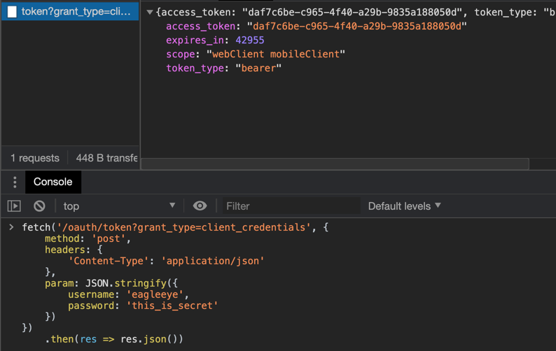

# 7장 마이크로서비스의 보안

## 7.1 OAuth2 소개
소개 할게 있나요. 그냥 우리가 흔히 쓰던건데...
1. 보호자원
2. 자원소유자
3. 애플리케이션
4. OAuth2 인증 서버

## 7.2 작게 시작: 스프링과 OAuth2로 1개의 엔드포인트 보호

### 7.2.1 EagleEye OAuth2 인증 서비스 설정
책의 내용과 다르게 최신 버전(Hoxton.SR7)에서는
```xml
    <dependency>
      <groupId>org.springframework.cloud</groupId>
      <artifactId>spring-cloud-starter-oauth2</artifactId>
    </dependency>
```
이렇게 되야 할 것 같네요.

### 7.2.2 클라언트 애플리케이션을 OAuth2 서비스에 등록
[OAuth2 설정](./src/main/java/study/spring/springmsajohncarnell/chapter07/OAuth2Config.java) 코드는 깃헙에서 보시고

### 7.2.3 EagleEye 사용자 구성
[Spring Security 설정](./src/main/java/study/spring/springmsajohncarnell/chapter07/SecurityConfig.java) 코드도 깃헙에서 보시고.

### 7.2.4 사용자 인증
음... 이상하다. 뭔가 잘못했는데 뭔지 모르겠네요. OAuth2 쪽에 설정한 client 로만 로그인 되네요.  
  

그리고 `/user` 에 접근하면  
  
해더에 `Authorization` 을 `bearer` 로 인증 토큰을 넣어서 요청 해야하는거.
일단 여기까지만 하고 넘어가야겠어요. spring-security랑 oauth2 와의 관계는 나중에 찾아보는걸로...


## 7.3 OAuth2를 사용한 조직 서비스 보호
### 7.3.1 스프링 시큐리티와 OAuth2 jar 파일을 각 서비스에 추가
이것도 마찬가지로
```xml
    <dependency>
      <groupId>org.springframework.cloud</groupId>
      <artifactId>spring-cloud-starter-oauth2</artifactId>
    </dependency>
```
이렇게 의존성 주고요.

### 7.3.2 OAuth2 인증 서비스 통신을 위한 서비스 구성
[bootstrap.yml](../organization-service/src/main/resources/bootstrap.yml) 파일에 설정을
```yml
security:
  oauth2:
    resource:
      user-info-uri: http://localhost:8901/user
```
이렇게 넣어 주고, `@EnableResourceServer` 를 달아주면 해당 서비스가 **보호 자원**이라고 알리는 거래요.
HTTP 해더중에 OAuth2 토큰 정보를 확인하고 `security.oauth2.resource.user-info-uri` 을 통해서 토큰의 유효성을 확인한다는데... (저 엔드포인트와 규약된게 없는데 어떻게 확인하죠?)

### 7.3.3 서비스의 접근 대상 정의
`ResourceServerConfigurerAdapter.configure()` 를 구현해서 규칙을 정의 한대요.

역시 URL매핑하고 권한 설정은 시큐리티가 편하긴 하죠.
```java
  @Override
  public void configure(HttpSecurity http) throws Exception {
    http
        .authorizeRequests()
        .antMatchers(HttpMethod.DELETE, "/v1/organizations/**")
        .hasRole("ADMIN")
        .anyRequest()
        .authenticated()
    ;
  }
```

### 7.3.4 OAuth2 액세스 토큰 전파
알아서 잘 전파하면 된대요. `@EnableOAuth2Sso` 이거 쓰면 그냥 된다는 얘긴데...  
아참 여기서 중요한건 `RestTemplate` 에서 OAuth2 기능을 보강한 `OAuth2RestTemplate` 을 이용해서 실제 다른 서비스 호출을 용이하게 할 수 있대요.

## 7.4 자바스크립트 웹 토큰과 OAuth2
JWT 가 자바스크립트였던가요? 지금까지 JSON 으로 알고 있었는데... ~~충격~~  

### 7.4.1 JWT 발행을 위한 인증 서비스 수정
### 7.4.2 마이크로서비스에서 JWT 사용
### 7.4.3 JWT 토큰 확장
### 7.4.4 JWT 토큰에서 사용자 정의 필드 파싱

이건 코드 들이니깐, 코드로 정리.

## 7.5 마이크로서비스 보안을 마치며
HTTPS/TLS 쓰고,  
게이트웨이 잘 활용하고,  
네트웍 설정 잘해서 쓰라는 말씀.

아... 역시 보안은 어려운 주제인가, 아니면 지루한 주제인가...
