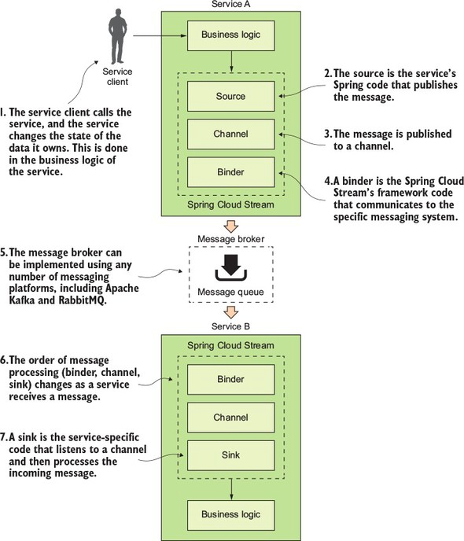

# 8. 스프링 클라우드 스트림을 사용한 이벤트 기반 아키텍처
진짜 비동기가 대세인가 봐요. 뭔가 비동기로 스케쥴링 하는데 오버해드가 발생하진 않을지도 걱정되는데...  
그래도 멀티 스레드 스케쥴링 보다는 좋다고 하니까 두고 보죠.

## 8.1 메세지와 EDA, 마이크로서비스의 사례

### 8.1.1 동기식 요청-응답 방식으로 상태 변화 전달
서비스간에 REST 로 요청을 받았을 때, 조회 대상을 캐싱하고 캐싱된 걸 업데이트 하고 하면서 서로 강결합 하게 되는거죠.
쉽게 깨지는 서비스가 되고, 경직된 서비스가 된다고 하네요.

### 8.1.2 메세징을 사용해 서비스간 상태 변화 전달
두 서비스간에 큐를 넣어서 상태가 변할 때 캐시를 적절히 조절해요.

#### 느슨한 결합
마이크로서비스는 수많은 작은 서비스로 분산되어 상호작용하면서 서로가 관리하는 데이터에 관심이 있어요.  
이럴 때 동기화된 HTTP 를 사용하면 서로 강결합 되는데, 메세징은 두 서비스간에 서로 알지 못하게 상태변화를 전달하면서 누가 메세지를 발행했는지 감춰준대요. 수신은 확인 할 수 있게 해주고요.

#### 내구성
서비스가 다운돼도 메세지 큐는 죽지 않아요. 독립적으로 살아서 돌아가니까.

#### 확장성
서비스가 서로 직접 연결되어서 요청-응답을 받게 되면, 많은 요청이 쏟아지면 응답쪽에서도 매칭되게 CPU("쓰레드" 가 더 어울릴까요?)를 쓰게 되는데 중간에 메세지 큐가 있으면 수평확장이 가능하다는 거죠.

#### 유연성
메세지를 누가 소비할지 모른다는 거. 이건 서로가 서로에게 영향을 주지 않을 수 있다는거니까 새로운 기능이 추가돼서 it's be ok~.

### 8.1.3 메세지 아키텍처의 단점

#### 메세지 처리의 의미론
독립적이지 않고, 서비스간에 순서가 정해지는 것등의 예외적인 처리 방식이 필요할 때가 난감한가 보네요.

#### 메세지 가시성
디버깅이 쉽지 않다는 얘기일까요? 주제에 "가시성" 이라고 했는데, 뭔가 잘 어울리지 않은 단어 선택인 것도 같은데... 그냥 디버깅이라고 하지...

#### 메세지 코레오그래피(choreography; 안무, 무용술)
역시 디버깅이 힘들다는 얘긴가봐요. 어려운 말을 써서 뭔가 싶었네요.


## 8.2 스프링 클라우드 스트림 소개
카프카가 짱이래요.

### 8.2.1 스프링 클라우드 스트림 아키텍처
두 서비스간에 발행자(publisher)와 소비자(consumer)가 되는데 스프링 스트림이 전달을 수월하게 해준대요.

  

#### Source
POJO 로 되어있는 메세지를 전달받아서 직렬화(JSON)하고 채널로 발행한대요.

#### Channel
큐를 추상화해서 채널이고 하나봐요. 

#### Binder
스프링 코드로 메세지 플랫폼하고 통신하게 해주는 거래요. 카프카나 RabbitMQ 같은 애들을 말하는 걸까 싶기도 하네요.

#### Sink
~~대충 보고 Sync 인줄...~~ 실제로 큐에서 메세지를 받는 건가봐요. 채널을 수신대기해서 POJO로 역직렬화해서 써먹는 거죠.


### 8.3 간단한 메세지 생산자와 소비자 작성
스프링 클라우드 스트림의 소스(메세지 생산자)와 싱크(메세지 소비자)만 사용해서 간단히 뭘 만들어 보나봐요.

#### 8.3.1 조직 서비스의 메세지 생산자 작성
조직 데이터의 CUD 가 있을 때, 카프카 토픽에 메세지를 발행해서 변경 이벤트를 발생시키게 한대요.

```xml
<dependency>
  <groupId>org.springframework.cloud</groupId>
  <artifactId>spring-cloud-starter-stream-kafka</artifactId>
</dependency>
```
의존성 추가하고요. (역시나 최신 버전에서는 `spring-cloud-stream` 이 내부 의존성에 포함되어 있어요.)  
`@EnableBinding(Source.class)` 이렇게 메세지 브로커에 바인딩하라고 알려주고요.

`org.springframework.cloud.stream.messaging.Source` 를 이용하는데요,
```java
@Component
@RequiredArgsConstructor
public class SimpleSourceBean {
  private final Source source;

  // ...

  public void publishOrgChange(String action,String orgId){
       logger.debug("Sending Kafka message {} for Organization Id: {}", action, orgId);
        OrganizationChangeModel change =  new OrganizationChangeModel(
                OrganizationChangeModel.class.getTypeName(),
                action,
                orgId,
                UserContext.getCorrelationId());

        source.output().send(MessageBuilder.withPayload(change).build());
  }
}
```
`source.output().send(MessageBuilder.withPayload(change).build());` 이렇게 해주면 되는군요. `OrganizationChangeModel` 는 리덕스 같기도 하고, 대충 알아서 맘대로 작성하면 되나봐요.

그리고 이렇게 만들어진 `SimpleSourceBean` 빈은 서비스에 주입해서 사용하고요.

### 8.3.2 라이선싱 서비스에서 메세지 소비자 작성
조직 서비스에서 메세지를 발행하도록 바꿨어요. 조직 서비스가 대상을 특정하지 않아도 관심있는 서비스들은 손들고 메세지를 전달 받을 수 있겠어요.  
라이선싱 서비스가 메세지를 소비하도록 해보죠.

역시나 똑같이 의존성 주입하고요.

```java
import org.springframework.boot.autoconfigure.SpringBootApplication;import org.springframework.cloud.stream.annotation.StreamListener;

@SpringBootApplication
// ... 
@EnableBinding(org.springframework.cloud.stream.messaging.Sink.class)
class Application {
    @StreamListener(Sink.INPUT)
    public void loggerSink(OrganizationChangeModel model) {
      logger.debug(...);
    }

    // ...
}
```

### 8.3.3 실제 메세지 서비스 보기
엔드포인트에 조직 변경 요청(PUT Method)을 보내면... ~~실제로 안해봐서... 잘 되겠죠~~


## 8.4 스프링 클라우드 스트림 사용 사례: 분산 캐싱
캐시 좋은건 다 알죠 뭐... 다만 갱신 시점을 조율하는게 관건인데, 갱신 시점에 메세지를 받으니까 활용도가 높겠네요.

### 8.4.1 레디스로 조회 캐싱
### 8.4.2 사용자 정의 채널 정의
### 8.4.3 종합: 메세지를 받으면 캐시 삭
음... 코드니깐 패스할게요.

근데, `@EnableBinding(CustomChannel.class)` 를 넣어서 새로운 채널을 만드는 데...  
EnableBinding 을 여러개 사용해도 잘 되겠죠?  

이번주도 이렇게 대충 넘어갑니다, 구렁이 담 넘듯...;;

