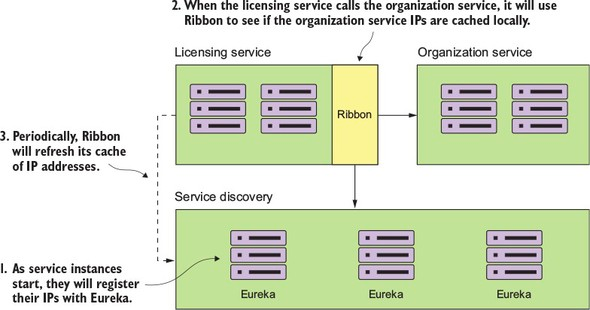
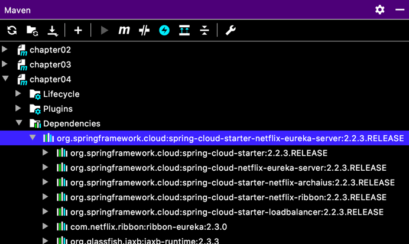

# 서비스 디스커버리
뭔가 길게 쓰여 있지만, 핵심은

- 수평적 확장/축소가 할 수 있고,
- 다운된 서비스를 배제하는 등의 라우팅으로 회복성을 향상 한다.

는 것 이라네요.
어렵게 말하는 것 같지만 어쨌든....

## 4.1 서비스 위치 찾기
구시대 하드웨어적 네트워크 라우팅 기술의 민낯을 파헤쳐 뼈를 때리면서, 앞으로 나아갈 방향을 모색하네요.
- 중앙집중식이니까 단일장에지점으로 병목이 유발되고,
- 서비스가 수평 확장을 못하는 것,
- 서비스를 유연하게 운영할 수 없고, (몇몇 업체가 독점적이라 문제가 있다는데...)
- 물리적인 서비스들의 위치 정보를 가져야 해서 여러 서비스가 산재돼 있다면 복잡도가 증가한다.

라면서 대량의 트랜젝션과 중복성을 다루는 클라우드 환경에는 부적절하다고 판단하네요.

## 4.2 클라우드에서 서비스 디스커버리
- 클러스터링을 이루고 동일한 정보를 공유해서 병목 없이 **고가용성(High-Available)**을 가지고,
- 클러스트링된 디스커버리 서비스들간에 인스턴스 상태를 공유하는 **P2P**가 돼야 하고,
- 요청에 대한 동적인 **부하 분산(Load-Balancing)**이 필요 하고,
- 서비스 디스커버리 클라이언트가 로컬 캐시를 통해서 가용되지 못하는 상황에서도 **회복성(Resilient)**을 갖추고,
- 망가진 서비스 인스턴스를 추려내서 장애를 감지하고 조치하는 **장애 내성(Fault-Tolerant)**을 겸비한

이런 매커니즘이 해결되어야 한대요.

### 4.2.1 서비스 디스커버리 아키텍쳐
구현 스펙에는,
- 서비스 등록
- 클라이언트가 서비스 주소 검색
- 디스커버리 노드들 간에 정보 공유
- 상태 모니터링

### 4.2.2 스프링 넷플릭스 유레카를 이용한 서비스 디스커버리

  
1. 서비스 인스턴스들이 시작되면서 각자의 IP를 유레카에 등록하고,
2. Licensing Service 가 Organization Service 를 호출할 때, Ribbon 을 사용해서 로컬에 캐시된 IP를 확인하고,
3. 주기적으로, Ribbon 은 캐시된 IP를 갱신해요.

## 4.3 스프링 유레카 서비스 구축
```xml
<!-- pom.xml -->
  <properties>
    <java.version>1.8</java.version>
    <spring-cloud.version>Hoxton.SR6</spring-cloud.version>
  </properties>

  <dependencies>
    <dependency>
      <groupId>org.springframework.cloud</groupId>
      <artifactId>spring-cloud-starter-netflix-eureka-server</artifactId>
    </dependency>
  </dependencies>
```
이게 현재 최신 버전이네요.

  
이렇게 의존성에 Ribbon 이 걸려 있어서 자동으로 포함 된대요.

```java
// Application.java
@SpringBootApplication
@EnableEurekaServer
public class Chapter04Application {

	public static void main(String[] args) {
		SpringApplication.runChapter04Application.class, args);
	}

}
```
`@EnableEurekaServer` 요거 달아주면 되고요.

## 4.4 스프링 유레카에 서비스 등록

건드리는게 많네요. 이것들은 [소스](./src/main/resources/application.yml)를 보시고요.

## 4.5 서비스 디스커버리를 사용해 서비스 검색

이것도 소스를 참조 하면되는데, 책의 내용과 스프링 부트, 스프링 클라우드 버전이 바뀌면서 꽤 많이 바뀐 것 같아요. ribbon 도 따로 의존성을 추가해 줘야 하고...
아무튼, 그러네요.
이번 장은 다시한번 꼼꼼히 살펴봐야 할 것 같아요.  
내용적으론 이해가 됐는데, 코드에서 각 서비스의 관계가 머릿속에 확 들어오진 않아서...
